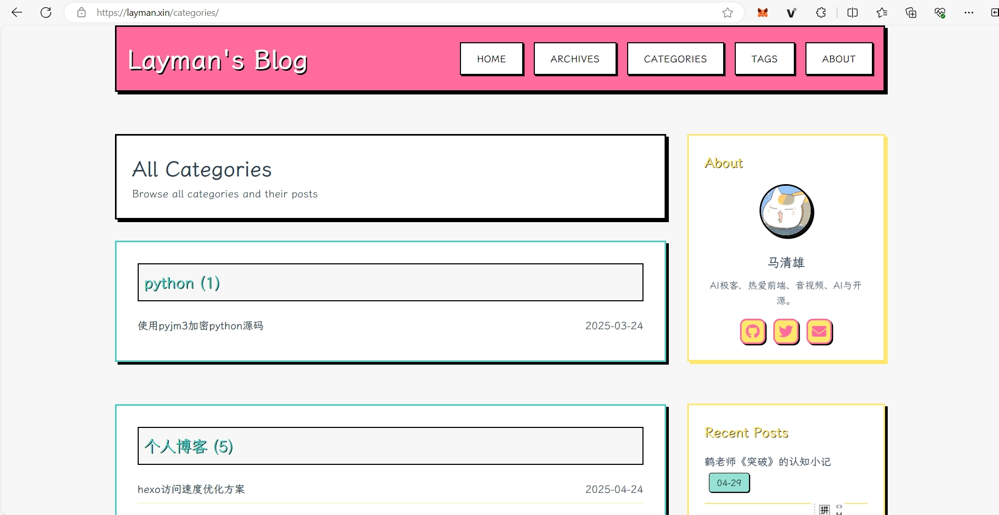

# Hexo Neubrutalism + 马卡龙配色主题博客

本项目是基于 Hexo 的自定义主题博客，采用 Neubrutalism 风格与马卡龙配色，极简美观，适合个人技术与生活分享。

## 主题特性
- **Neubrutalism 风格**，马卡龙配色，极简 UI
- 首页、文章页、归档、分类、标签等完整页面
- 响应式布局，右侧栏 About/社交/分类/标签/归档
- 代码块极简美化，支持行号、滚动条、无分隔线
- 文章详情页、首页、about 区域细节高度可控
- 霞鹜文楷字体，支持中英文优雅显示
- 首页 About 区域支持社交图标（含知乎）
- 支持图片懒加载、静态资源压缩、CDN 加速

## 预览





## 快速开始
1. **安装依赖**
   ```bash
   npm install
   # 推荐安装 hexo-filter-clean-css hexo-filter-uglify 以优化加载速度
   npm install hexo-filter-clean-css hexo-filter-uglify --save
   ```
2. **初始化 Hexo 并使用主题**
   ```bash
   hexo init blog
   cd blog
   # 将 themes/neubrutalism 目录复制到 blog/themes 下
   # 修改 _config.yml 中 theme: neubrutalism
   ```
3. **生成静态文件并本地预览**
   ```bash
   hexo clean && hexo g && hexo s
   # 访问 http://localhost:4000 查看效果
   ```

## 主题配置
- 详见 `themes/neubrutalism/_config.yml`，可自定义配色、社交链接、侧栏内容等。
- About 区域社交图标支持 github、twitter、email、zhihu 等。

## 性能优化建议
- 启用 hexo-filter-clean-css、hexo-filter-uglify 插件压缩 CSS/JS
- 图片建议提前压缩并使用 CDN
- 静态资源（如 Font Awesome、字体）建议用 jsDelivr、BootCDN 等加速
- 首页、分类、标签页建议分页（每页 5~10 篇）
- 开启服务器 Gzip/HTTP2

## 许可协议
MIT License 